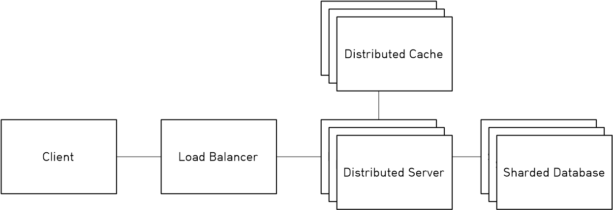
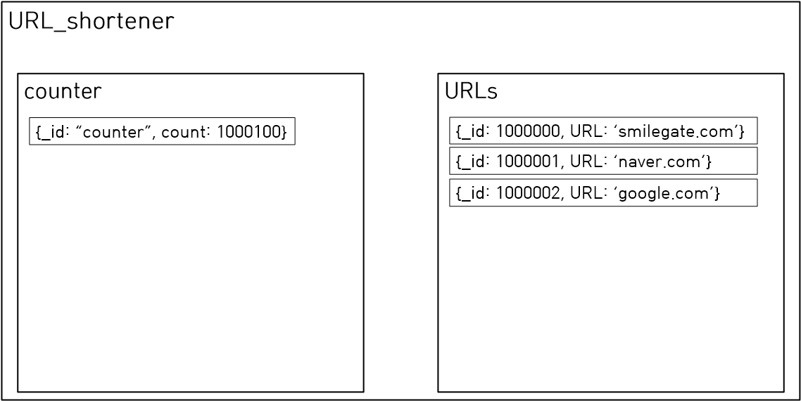

# 12/25 완료

# 1. Project Description
Scalable한 URL shortener를 고민한다.<br>

## Estimation And Constraints
### Traffic
한 번 DB에 write된 URL은 공유되어 여러 번 read된다.<br>
read/write ratio를 100 : 1로 가정했다.<br>
1초에 만들어지는 unique한 shortened url의 개수: 40URLs/second<br>
1초에 redirect되는 URL의 개수: 4000URLs/second<br>

### Storage
총 필요한 메모리의 크기를 6TB라 가정한다.<br>

### Memory
Pareto Principle를 따르는 cache system을 구현한다.<br>
35GB의 in-memory cache가 필요하다.

## High Level Design And Future Work
### High Level Design
#### Ideal Architecture


#### Proposed Architecture In This Project

Ideal architecture에서 하나의 서버와 하나의 데이터베이스만을 시뮬레이션한다.<br>

##### Possible Hazard<br>
1. Server and DataBase can be a single point of failure

## Implementaition of Proposed Architecture
- [counter.js](./src/utils/counter.js)<br>

Unique key를 위하여 counter approach를 사용한다.<br>
SQL을 사용한다면 auto incrementation을 사용했겠지만, Scalability를 위하여 NoSQL을 선택했고 counter를 위한 collection을 따로 만들었다.<br>
counter는 한 번 접근할 때 하나의 큰 덩어리를 받아와서 write가 될 때마다 counter를 collection에서 받아오는 것을 방지한다.<br>
서버가 중지된다면 받아온 덩어리 중 사용하지 못 한 부분이 소실되지만 counter space가 커서 큰 문제가 되지 않는다.<br>

- [base62.js](./src/utils/base62.js)<br>
counter를 base62로 표기하여 shortened URL을 제공한다.<br>

- [simple_cache.js](./src/utils/simple_cache.js)<br>
저장된 URL이 변하지 않기에 요청된 URL을 cache하여 데이터베이스에 접근하는 latency를 줄일 수 있다.<br>
cache는 구현을 위해 단순한 LRU cache를 Map을 이용하여 구현하였다.<br>
데이터베이스에 엑세스하는 경우는 크게 두 가지로 나뉠 수 있다.<br>
1. 입력된 URL에 대해 이미 shorten된 URL이 존재하는지 검색한다.<br>
2. base62로 encoded된 counter로 original URL을 검색한다.<br>
이 중에서 2.가 주요 bottleneck이 될거라고 생각하여 key as encoded count, value as URL을 가지는 캐시만을 구현하였다.<br>
1.에 대한 구현은 memory와 latency의 trade off를 통해 결정할 수 있다.<br>

# 2. 기술 스택
- JavaScript with Express.js and Node.js<br>
Frontend와 Backend를 동시에 처리하기 위해 사용하였다.<br>
sync, async 부분의 작동 원리는 조금 더 공부가 필요할 것 같다.<br>

- MongoDB<br>
저장할 데이터가 간단했고 join이나 복잡한 query가 발생하지 않고 대용량의 데이터가 저장될 것 같아 분산을 쉽게 지원하는 NoSQL 중에 가장 대중적인 것을 선택하였다.<br>


# 3. 코드 중 확인받고 싶은 부분
1. async를 사용해서 구현한 함수들(async의 장점을 살릴 방법)<br>
2. [url_shortener.js](./src/routes/url_shortener.js)<br><br>
    기존 utils들은 기존 프로그래밍과 비슷해서 쉽게 했는데, 웹 프로그래밍은 이번이 처음이라 가장 고민을 많이 한 부분이다.<br>
3. [app.js](./src/app.js)의 오류 처리 함수<br>
```JavaScript
app.use(function(error, req, res, next) {
    console.log(error);
    res.status(500).send(error);
});
```
단순하게 error를 담아서 보내는데 이보다 더 좋은 처리 방법을 알고 싶다.<br>
4. [url_shortener.js](./src/routes/url_shortener.js)의 dynamic routes 부분<br>
```JavaScript
router.get('/:encodedId', async function (req, res, next);
```
Shortened URL을 original URL로 바꿔주기 위해 이렇게 dynamic route를 구성했다.<br>
다만, 브라우저가 자동으로 요청하는 http://localhost:3000/favicon.ico 때문에 오류가 나서 favicon.ico를 실제로 public에 저장해서 해결했다.<br>
이는 /app/:encodedId 등으로 경로를 조금 더 자세하게 지정하는 방법으로 해결할 수 있을 것 같은데, 가장 효율적인 방법은 무엇인가 궁금하다.<br>

# 4. 개발 관련 과정에서 궁금했던 부분
1. SQL과 NoSQL의 Read/Write Time Complexity<br>
인터넷을 보면 NoSQL이 SQL보다 빠르다던데, ACID를 타협하는 부분이 있으니 그 부분이 빨라지는 것은 이해된다.<br>
SQL의 Read Complexity를 생각해보면 O(n)이나 O(logn)을 가질 것 같은데 NoSQL은 작동 원리를 정확히 공부를 못 해서 대략적인 Complexity를 알 수 없었다.<br>
NoSQL이 특정 연산에서 SQL보다 빠른 이유와 NoSQL이 query를 하는 원리가 궁금하다.<br>
2. async의 장점을 살릴 방법<br>
async를 살리기 위해서는 따로 인터럽트를 이용해야 할 것 같은데 이 부분에 대한 공부가 더 필요할 것 같다.<br>
가령 온라인으로 체스를 둘 수 있는 기능을 만든다고 하면 다른 사용자가 수를 둔 것을 async하게 받아야 할 것 같은데 이러한 것들이 어떻게 해결될 수 있는지가 궁금하다.<br>
3. Architecture를 제한하는 방법<br>
여러가지 자원의 제한으로 개발에서 많은 타협이 이루어질 것이라고 생각한다.<br>
이번 개발에서는 다중 서버 및 분산화된 데이터베이스를 구현할 수 없어서 단순화한 architecture로 구현했는데, 이는 scalable하지 않다고 생각한다.<br>
scalable을 유지하면서 타협하는 방법이 궁금하다.<br>

# 5. References
1. https://medium.com/@sandeep4.verma/system-design-scalable-url-shortener-service-like-tinyurl-106f30f23a82
2. https://dev.to/karanpratapsingh/system-design-url-shortener-10i5
3. https://www.mongodb.com/docs/manual/sharding/#sharding-strategy
4. https://www.geeksforgeeks.org/system-design-url-shortening-service/